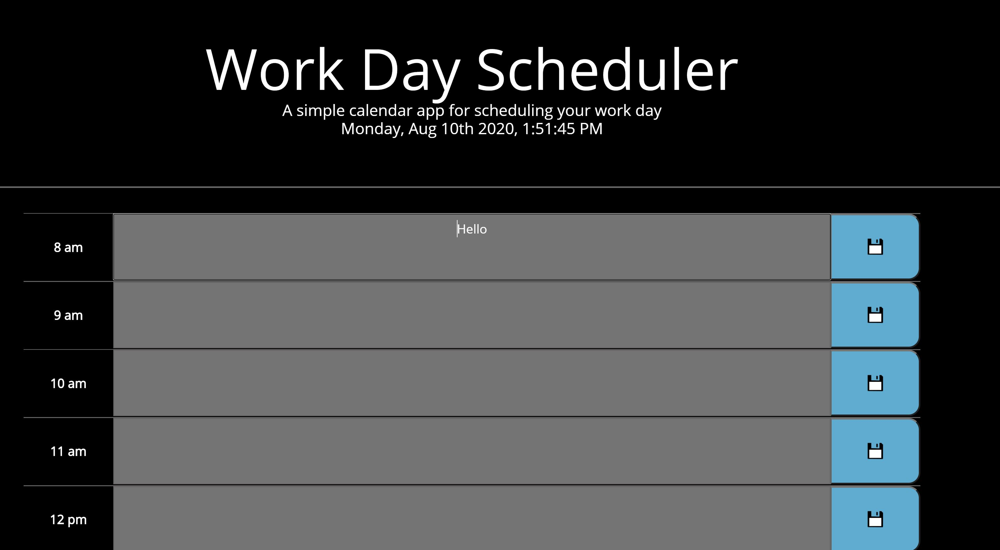

Homework #5: Work Day Scheduler by Cristino Perez (https://github.com/cperez525)

Repository URL: https://github.com/cperez525/work_day_scheduler

Deployed App URL: https://cperez525.github.io/work_day_scheduler/

The Work Day Scheduler is designed to help you keep your work day organized! Simply enter any event in the text block adjacent to the desired time, and click the save button.

This app was developed using HTML, CSS, and Javascript.

Screenshots:

1) Scheduler page-  
2) Scheduler page past/present/future block colors-  

Note: this application is designed to clear local storage once the weekday changes. IE- Anything you saved yesterday will not be accessible today.
